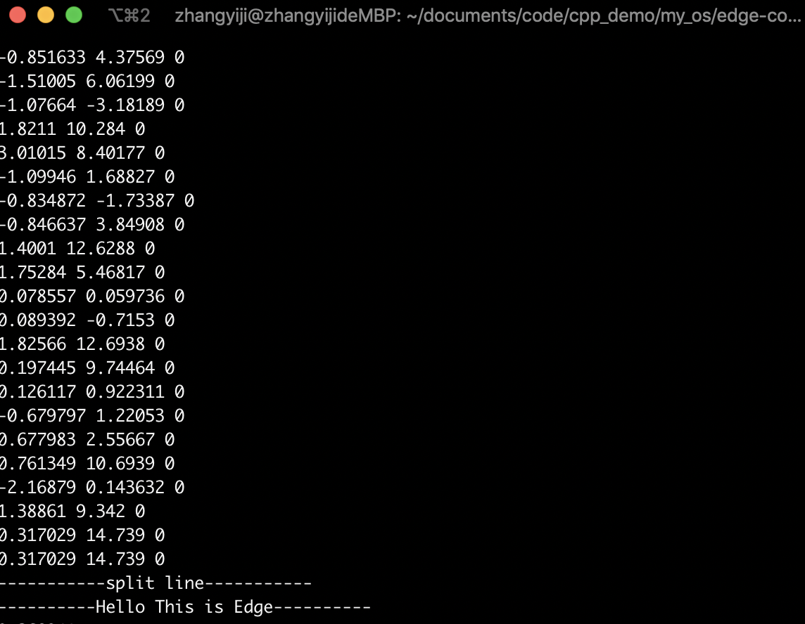

Edge-Computing-Engine

Edge : 一个开源的科学计算引擎

[](https://github.com/AllenZYJ/Edge-Computing-Engine/blob/add-license-1/LICENSE)

目前实现的:

> Matrix API:

- [x] Create a matrix :  create(row,cols)
- [x] Change the element for matrix void move_ele(int &ele1, int &ele2)
- [x] Matrix1+Matrix2 : Matrix add(Matrix mid1,Matrix mid2,int flag=1)
- [x] Flag is how to compete the ele ,default 1 ,bitwise operation(位运算加速).
- [x] Matrix1-Matrix2 : Matrix subtract(Matrix mid1,Matrix mid2)
- [x] Matrix1*Matrix2 : Matrix mul(Matrix mid1,Matrix mid2)
- [x] Matrix1*n : Matrix times_mat(int times,Matrix mid1)
- [x] Matrix1's Transposition : Matrix get_T(Matrix mid1)
- [x] Mul(matrix1,matrix2)
- [x] Return a flattened array.
- [x] Matrix matrix_rs(Matrix mid1,int rs_row,int rs_col)
- [x] double matrix_sum(Matrix mid1)
- [x] double matrix_mean(Matrix mid1)
- [x] Matrix appply(Matrix mid1,Matrix mid2,int axis = 0)

Matrix **A**：

| 第1列   | 第2列   | 第3列   | 第4列   | 第5列   |
| ------- | ------- | ------- | ------- | ------- |
| 72.0000 | 0.0000  | 0.0000  | 0.0000  | 0.0000  |
| 0.0000  | 64.0000 | 0.0000  | 0.0000  | 0.0000  |
| 16.0000 | 8.0000  | 0.0000  | 0.0000  | 0.0000  |
| 0.0000  | 0.0000  | 56.0000 | 16.0000 | 32.0000 |
| 0.0000  | 0.0000  | 0.0000  | 0.0000  | 0.0000  |
| 0.0000  | 0.0000  | 0.0000  | 0.0000  | 0.0000  |

​	MAtrix **B**：

| 第1列   | 第2列   | 第3列   | 第4列   | 第5列  | 第6列  |
| ------- | ------- | ------- | ------- | ------ | ------ |
| 72.0000 | 0.0000  | 16.0000 | 0.0000  | 0.0000 | 0.0000 |
| 0.0000  | 64.0000 | 8.0000  | 0.0000  | 0.0000 | 0.0000 |
| 0.0000  | 0.0000  | 0.0000  | 56.0000 | 0.0000 | 0.0000 |
| 0.0000  | 0.0000  | 0.0000  | 16.0000 | 0.0000 | 0.0000 |
| 0.0000  | 0.0000  | 0.0000  | 32.0000 | 0.0000 | 0.0000 |

​	To

| 第1列     | 第2列     | 第3列     | 第4列     | 第5列  | 第6列  |
| --------- | --------- | --------- | --------- | ------ | ------ |
| 5184.0000 | 0.0000    | 1152.0000 | 0.0000    | 0.0000 | 0.0000 |
| 0.0000    | 4096.0000 | 512.0000  | 0.0000    | 0.0000 | 0.0000 |
| 1152.0000 | 512.0000  | 320.0000  | 0.0000    | 0.0000 | 0.0000 |
| 0.0000    | 0.0000    | 0.0000    | 4416.0000 | 0.0000 | 0.0000 |
| 0.0000    | 0.0000    | 0.0000    | 0.0000    | 0.0000 | 0.0000 |
| 0.0000    | 0.0000    | 0.0000    | 0.0000    | 0.0000 | 0.0000 |

- [x] ​		double* flatten(Matrix mid1)

|  1   |  2   |  3   |
| :--: | :--: | :--: |
|  2   |  4   |  6   |
|  7   |  8   |  9   |

​	To

| 1    | 2    | 3    | 2    | 4    | 6    | 7    | 8    | 9                  |
| ---- | ---- | ---- | ---- | ---- | ---- | ---- | ---- | :----------------- |
|      |      |      |      |      |      |      |      | Like numpy.flatten |

update 2019/11/20/00:06

apply API:

function:

​	Matrix appply(Matrix mid1,Matrix mid2,int axis = 0)

> 参数 axis=0 :

| 0    | 7    | 2    |
| ---- | ---- | ---- |
| 0    | 3    | 1    |
| 0    | 0    | 0    |
| 0    | 0    | 11   |
| 0    | 7    | 2    |
| 0    | 3    | 1    |
| 0    | 0    | 0    |
| 0    | 0    | 11   |
------

> axis = 1:

| 0    | 7    | 2    | 0    | 7    | 2    |
| ---- | ---- | ---- | ---- | ---- | ---- |
| 0    | 3    | 1    | 0    | 3    | 1    |
| 0    | 0    | 0    | 0    | 0    | 0    |
| 0    | 0    | 11   | 0    | 0    | 11   |

------

更新2019/11/18/00:12

- [x] read_csv 

- [x] return a matrix

  CSV head :

  | -0.017612 | 14.053064 | 0    |
  | --------- | --------- | ---- |
  | -1.395634 | 4.662541  | 1    |
  | -0.752157 | 6.53862   | 0    |
  | -1.322371 | 7.152853  | 0    |
  | 0.423363  | 11.054677 | 0    |
  | 0.406704  | 7.067335  | 1    |

  Get:

  

  

  ## demo:

```c
#include<iostream>
#include<ctime>
#include<string>
#include <time.h>
#include <math.h>
#include <fstream>
#include"./matrix/matrix_def.h"
#include"./matrix/matrix_pro.h"
#include"./welcome/score_wel.cpp"
#include"./logistic/logistic_def.h"
#include"./file_pro/data_read.h"
using namespace std;
clock_t start, stop;
double duration;
int main()
{
	string path = "./data.csv";
	Matrix data = read_csv(path);
	for(int index_x = 0;index_x<data.row;index_x++)
	{
		for(int index_y=0;index_y<data.col;index_y++)
		{
			cout<<data.matrix[index_x][index_y]<<" ";
		}
		cout<<endl;
	}
	cout<<"-----------split line-----------"<<endl;

   	welcome();
	Matrix a = CreateMatrix(4,3);
	double a_ = e_sigmoid(1);	
	cout<<a_<<endl;
	change_va(a,1,2,1);
	change_va(a,0,1,7);
	change_va(a,0,2,2);
	change_va(a,1,1,3);
	change_va(a,3,2,11);	
	
	start = clock();

	Matrix applyed_ma = appply(a,a,1);
	for(int index_x = 0;index_x<applyed_ma.row;index_x++)
	{
		cout<<"|";
		for(int index_y=0;index_y<applyed_ma.col;index_y++)
		{
			cout<<applyed_ma.matrix[index_x][index_y]<<"|";
		}
		cout<<endl;
	}
	cout<<"matrix sum: "<<matrix_sum(a)<<endl;
	cout<<"matrix mean: "<<matrix_mean(a)<<endl;
	cout<<"matrix T: "<<endl;
	cout<<"--------split---------"<<endl;
	Matrix b = get_T(a);
	for(int index_x = 0;index_x<b.row;index_x++)
	{
		for(int index_y=0;index_y<b.col;index_y++)
		{
			cout<<b.matrix[index_x][index_y]<<" ";
		}
		cout<<endl;
	}
	cout<<"-----------split line-----------"<<endl;
	cout<<"matrix*n"<<endl;
	Matrix c = times_mat(8,b);
	for(int index_x = 0;index_x<c.row;index_x++)
	{
		for(int index_y=0;index_y<c.col;index_y++)
		{
			cout<<c.matrix[index_x][index_y]<<" ";
		}
		cout<<endl;
	}
	cout<<"-----------split line-----------"<<endl;
	cout<<"matrix*matrix"<<endl; 
	Matrix d =mul(c,get_T(c));
	for(int index_x = 0;index_x<d.row;index_x++)
	{
		for(int index_y=0;index_y<d.col;index_y++)
		{
			cout<<d.matrix[index_x][index_y]<<" ";
		}
		cout<<endl;
	}
	cout<<"-----------split line-----------"<<endl;
	Matrix rs = matrix_rs(a,6,5);
	for(int index_x = 0;index_x<rs.row;index_x++)
	{
		for(int index_y=0;index_y<rs.col;index_y++)
		{
			cout<<rs.matrix[index_x][index_y]<<" ";
		}
		cout<<endl;
	}
	times_mat(5,a);
	stop = clock();
    printf("%f\n", (double)(stop - start) / CLOCKS_PER_SEC);
	return 0;
}
```
Something :

> 1. Matrix'element is default 1
> 2. Dynamically allocate memory to prevent matrix from being too large
> 3. To save memory and delete later,  use pointer to open up array space temporarily
> 4. if free please delete(matrix);
> 5. Api design like numpy or pandas
> 6. Talking is cheap u can get the code
> 7. welcome 🏃watched and star.
>

# PS

 个人小站:[极度空间](likedge.top)

作者邮箱:zk@likedge.top | edge@ibooker.org.cn

 QQ:2533524298